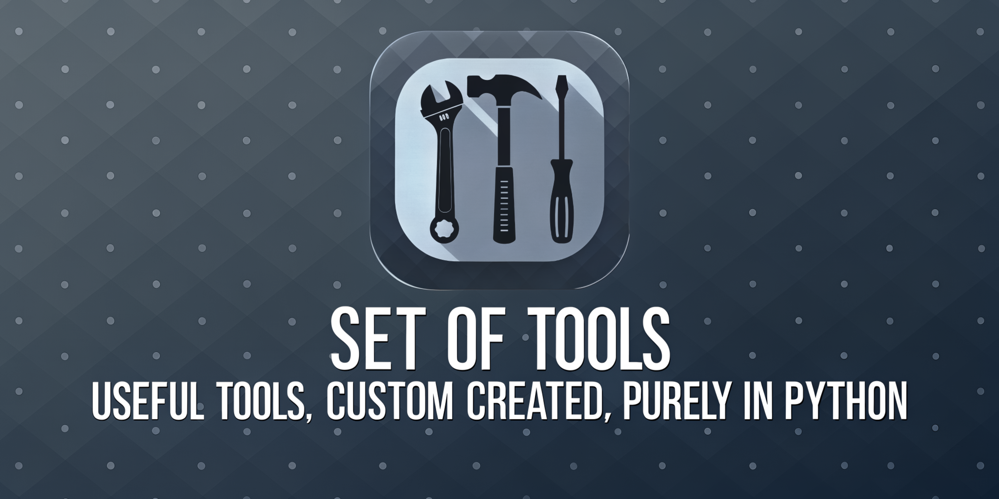

# Set-of-Tools



A personal repository housing a collection of practical tools, primarily focused on image processing and system utilities, now consolidated into a unified Graphical User Interface (GUI) application. It also includes a web crawling notebook.

## Overview

This repository provides a suite of useful applications integrated into a single interface, alongside a specialized web crawling tool:

**GUI Application Tools:**

1.  **Image Format Converter:** Converts images between various formats (e.g., PNG, JPEG, WEBP) and allows optional resizing. Includes an image preview.
2.  **Image Modifier:** Resizes images with options to maintain aspect ratio. Crops images either by entering coordinates or **interactively selecting an area by dragging on the preview**. Includes an image preview.
3.  **Folder Icon Setter:** Changes folder icons to custom icons on Windows (.ico) and macOS (.icns). Includes an icon preview. *Note: Requires appropriate icon format for the target OS and may need administrative privileges on Windows.*
4.  **Image to SVG Converter:** Transforms raster images (like PNG, JPG) into vector SVG format using techniques like color quantization and contour tracing. Includes an image preview.

**Standalone Notebook:**

5.  **Web Crawler (`notebooks/LLM_Crawl4AI.ipynb`):** A Google Colab notebook designed to crawl websites based on their sitemaps using the `crawl4ai` library. It extracts content and saves it in Markdown format.

*(Note: A previous background removal tool is no longer part of this project).*

## Setup

### Prerequisites

*   Python 3.7 or newer (Tested primarily with Python 3.x versions)
*   `pip` (Python package installer, usually included with Python)

### Installation

1.  **Clone the repository:**
    ```bash
    git clone <YOUR_REPOSITORY_URL> # Replace with the actual URL
    cd set-of-tools
    ```

2.  **Create and activate a virtual environment (Highly Recommended):**
    *   **Windows:**
        ```bash
        python -m venv .venv
        .venv\Scripts\activate
        ```
    *   **macOS/Linux:**
        ```bash
        python3 -m venv .venv
        source .venv/bin/activate
        ```

3.  **Install dependencies for the GUI application:**
    ```bash
    pip install -r requirements.txt
    ```
    *(Note: Dependencies for the Colab notebook are installed within the notebook itself).*

## Usage

### Main GUI Application (Image Tools)

1.  Ensure your virtual environment (e.g., `.venv`) is activated.
2.  Navigate to the project's root directory (`set-of-tools`) in your terminal.
3.  Run the main application:
    ```bash
    python src/main.py
    ```
4.  The application window will appear (styled using `ttkthemes`), featuring tabs for each tool:
    *   **Format Converter:** Select an input image (preview shown), choose the desired output format, specify resizing options (if any), and click "Convert Image".
    *   **Image Modifier:** Select an input image (preview shown). Enter desired dimensions for resizing (with option to keep aspect ratio) or **click and drag on the preview image to select a crop area** (coordinates will auto-populate). Click "Resize Image" or "Crop Image".
    *   **Folder Icon Setter:** Select an icon file (`.ico` for Windows, `.icns` for macOS) (preview shown) and the target folder. Click "Apply Icon to Folder". Remember OS-specific requirements and potential admin rights needed on Windows.
    *   **Image to SVG:** Choose an input image (preview shown). Adjust conversion parameters (number of colors, tolerance, opacity threshold, simplification factor) as needed for optimal results. Click "Convert to SVG".

### Web Crawler (Google Colab Notebook)

1.  Upload or open the `notebooks/LLM_Crawl4AI.ipynb` file in Google Colaboratory (colab.research.google.com).
2.  Execute the notebook cells sequentially. Follow the instructions within the notebook to:
    *   Install necessary Python packages (`crawl4ai`, etc.) within the Colab environment.
    *   Configure the target website's sitemap URL and any other parameters.
    *   Run the crawling and content extraction process.
    *   Access the generated Markdown output.

## Project Structure

```
set-of-tools/
├── .venv/                   # Virtual environment directory (if created)
├── notebooks/               # Jupyter/Colab notebooks
│   └── LLM_Crawl4AI.ipynb   # Web crawler notebook
├── src/                     # Source code for the GUI application
│   ├── assets/              # Static assets like images
│   │   └── banner.png       # Application banner
│   ├── core/                # Core backend logic (no GUI elements)
│   │   ├── __init__.py
│   │   ├── image_converter.py     # Logic for image format conversion
│   │   ├── image_modifier.py      # Logic for image resizing and cropping (NEW)
│   │   ├── folder_icon_setter.py  # Logic for setting folder icons
│   │   └── svg_converter.py       # Logic for image-to-SVG conversion
│   ├── gui/                 # GUI components (Tkinter-based, themed with ttkthemes)
│   │   ├── __init__.py
│   │   ├── main_window.py     # Defines the main application window (Notebook layout)
│   │   └── tabs/              # Modules for each tool's GUI tab
│   │       ├── __init__.py
│   │       ├── converter_tab.py   # UI for Format Converter (with preview)
│   │       ├── modifier_tab.py    # UI for Image Modifier (NEW, with preview)
│   │       ├── icon_setter_tab.py # UI for Folder Icon Setter (with preview)
│   │       └── svg_tab.py         # UI for Image to SVG Converter (with preview)
│   ├── utils/               # Shared utility functions
│   │   ├── __init__.py
│   │   └── file_helpers.py    # Helpers for file/folder dialogs
│   ├── __init__.py
│   └── main.py              # Entry point to launch the GUI application
├── .gitignore               # Specifies intentionally untracked files
├── LICENSE                  # Project license information (Apache 2.0)
├── README.md                # This file: Project overview and instructions
└── requirements.txt         # Python dependencies for the src application
```

## Detailed Description of Components

### `src/` Directory

Contains all the source code for the unified GUI application built using Python, Tkinter, and `ttkthemes` for styling.

*   **`main.py`**: The main script to launch the application. It uses `ttkthemes.ThemedTk` to apply a visual theme and initializes the `MainWindow` from `gui/main_window.py`.
*   **`assets/`**: Stores static assets used by the application, such as the banner image.
*   **`core/`**: Houses the backend logic for each tool, ensuring separation of concerns from the user interface. Includes modules for image format conversion (`image_converter.py`), resizing/cropping (`image_modifier.py`), folder icon setting (`folder_icon_setter.py`), and SVG conversion (`svg_converter.py`).
*   **`gui/`**: Contains the user interface code.
    *   `main_window.py`: Defines the main application window, using a `ttk.Notebook` widget to manage the different tool tabs and integrating the individual tab modules.
    *   `tabs/`: Each Python file here corresponds to a tab in the GUI (e.g., `converter_tab.py`, `modifier_tab.py`). They define the layout, widgets (buttons, labels, entry fields, image previews), and event handling for each specific tool, linking UI actions to the corresponding functions in the `core/` modules.
*   **`utils/`**: Provides shared utility functions, like `file_helpers.py` which offers standardized methods for opening file and folder selection dialogs.

### `notebooks/` Directory

*   **`LLM_Crawl4AI.ipynb`**: A Jupyter Notebook specifically designed for use in Google Colab. It leverages the `crawl4ai` library to crawl websites via their sitemaps, extract relevant content, and save it as Markdown files. Refer to the "Usage" section and the comments within the notebook for detailed steps.

### `requirements.txt`

Lists the Python packages required to run the GUI application (`src/main.py`). Key dependencies include:

*   `Pillow`: Essential for image loading, processing, manipulation (resizing, cropping), and saving across various formats. Also used for generating Tkinter-compatible image previews.
*   `ttkthemes`: Used to apply modern visual themes to the Tkinter GUI.
*   `numpy`: Used for efficient numerical operations, particularly relevant in image data handling (dependency for scikit-image/learn).
*   `scikit-image`: Provides algorithms for image processing tasks, such as contour finding used in the SVG conversion process.
*   `scikit-learn`: Utilized for its KMeans implementation, employed for color clustering/quantization during SVG conversion.
*   `svgwrite`: A library for programmatically generating SVG (Scalable Vector Graphics) files.

**Important:** The `LLM_Crawl4AI.ipynb` notebook manages its own dependencies (like `crawl4ai`, `httpx`, `ipywidgets`). These are installed directly within the Google Colab environment via commands in the notebook's setup cells and are *not* included in the main `requirements.txt` file.

## Contributing

While this is primarily a personal project, contributions, suggestions, or bug reports are welcome. Feel free to fork the repository, make your improvements, and submit a pull request.

## License

This project is licensed under the **Apache License 2.0**. See the `LICENSE` file for more details.
